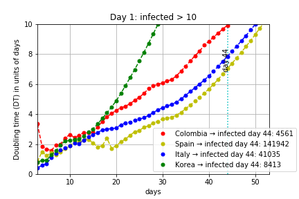

# COVID-19
## Exponential model for Colombia. See [`covid.ipynb`](./covid.ipynb) for details.
Updated on a daily basis

 

[diff](https://app.reviewnb.com/restrepo/Covid-19/) - [Real Time World](https://drive.google.com/uc?id=1Om7RI8X2k527K5xRuHp-kGT-W0mYSy-c) [[PDF]](https://bit.ly/covid-19-realtime) [[Live stream from udea email]](https://stream.meet.google.com/stream/0f31bd82-dc97-4870-93e0-ffe5399e8b55)

## Links
### World statistics
* https://ourworldindata.org/coronavirus
### Models
Relevance ordering
* IHME COVID-19 health service utilization forecasting team. Forecasting COVID-19 impact on hospital bed-days, ICU-days, ventilator days and deaths by US state in the next 4 months. MedRxiv. 26 March 2020. doi: [PDF](http://www.healthdata.org/sites/default/files/files/research_articles/2020/COVID-forecasting-03252020_4.pdf)
    * [Data visualizations](https://covid19.healthdata.org/projections)
* [Covid-19 infection in Italy. Mathematical models and predictions](https://towardsdatascience.com/covid-19-infection-in-italy-mathematical-models-and-predictions-7784b4d7dd8d)
* Doubling times analysis: [Forbes](https://www.forbes.com/sites/startswithabang/2020/03/17/why-exponential-growth-is-so-scary-for-the-covid-19-coronavirus/#66dd44434e9b) → [Result](https://raw.githubusercontent.com/restrepo/Covid-19/master/img/doubling.jpg)
* https://twitter.com/burkert_andreas/status/1239692655833071616
* https://youtu.be/Kas0tIxDvrg?t=249
* [R0 model](https://www.youtube.com/watch?v=OWic9kU83zs)
* [Logístico mejorado España](https://biocomsc.upc.edu/en/media/entender-el-covid-19.pdf)
* The generalized-growth model (GGM)
    * Detailed explanation: https://doi.org/10.1016/j.idm.2017.08.001
    * [GGM Spain part 1](https://sistemaencrisis.es/2020/03/10/evidencia-sobre-la-dinamica-de-crecimiento-del-covid-19-en-espana/)
    * [GGM Spain part 2](https://sistemaencrisis.es/2020/03/24/de-que-cifras-estamos-hablando-cuando-se-dice-que-lo-peor-esta-por-llegar/)
* SI model
    * [SI and SIR explanations](https://github.com/DataForScience/Epidemiology101/blob/master/Epidemiology101.ipynb)
* SIR models
    * [SIR España](http://covid19.webs.upv.es/) → [Ejemplo predicción](https://www.meneame.net/m/tecnolog%C3%ADa/go?id=3273705)
    * [SIR Colombia](https://github.com/Camilo-HG/COVID-19)
    * [SIR Colombia](https://github.com/jyosa/covid-19_colombia)
    * [Outreach explanation](https://www.wired.com/story/the-mathematics-of-predicting-the-course-of-the-coronavirus/)
* SEIR model
    * [SEIR world](https://www.imperial.ac.uk/mrc-global-infectious-disease-analysis/news--wuhan-coronavirus/?fbclid=IwAR3OjCojHKJ8XyvRFAoe7x8HjYF5-6tslvw1M-qYlV08gRwRGFO6bwB5rZQ) [PDF](https://www.imperial.ac.uk/media/imperial-college/medicine/sph/ide/gida-fellowships/Imperial-College-COVID19-Global-Impact-26-03-2020.pdf)
    
* Deaths based
    * Using South Korea death rates for (Spain)[http://institucional.us.es/blogimus/2020/03/como-estimar-el-numero-de-infectados-reales-por-covid-19-el-caso-de-andalucia-e-italia/]
### Colombia data
* [Official Colombia data](https://infogram.com/covid-2019-ins-colombia-1hnq41zg9ord63z)
* [Reports every 12 hours at 10:00 and 22:00](https://twitter.com/MinSaludCol)
### Historical data
* [How some cities ‘flattened the curve’ during the 1918 flu pandemic](https://www.nationalgeographic.com/history/2020/03/how-cities-flattened-curve-1918-spanish-flu-pandemic-coronavirus/?fbclid=IwAR2YfP6crf3FqtEBsgaq3xCkFrpYlIk9EcmtWv-lvC6MXIu8hH7IUfWY3bA)
